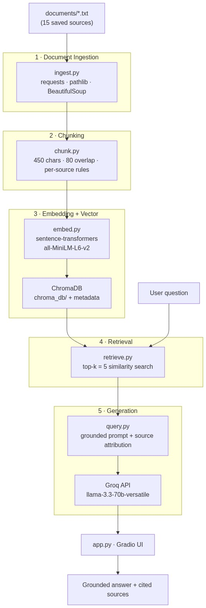
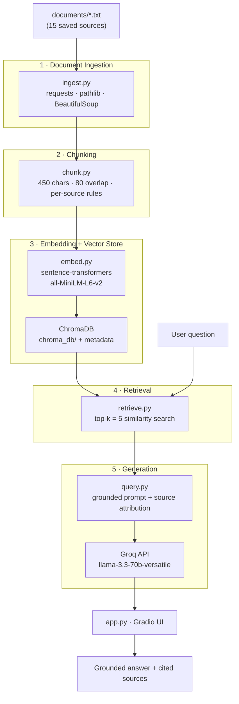

# Project 1 Planning: The Unofficial Guide

> Write this document before you write any pipeline code.
> Your spec and architecture diagram are what you'll use to direct AI tools (Claude, Copilot, etc.) to generate your implementation — the more specific they are, the more useful the generated code will be.
> Update the Retrieval Approach and Chunking Strategy sections if you change your approach during implementation.
> Update this file before starting any stretch features.

---

## Domain

**Cornell Information Science — what students actually say about courses, professors, and building a career.**

This Unofficial Guide covers Cornell's INFO major from a student perspective: which courses are worth taking, what professors are really like, how to navigate affiliation and registration, and how IS students find internships and research. Official Cornell materials list requirements and course descriptions, but they do not capture exam difficulty, project load, teaching style, or the practical advice seniors pass down. This system makes that scattered student knowledge — forum threads, professor reviews, student wiki pages, and campus reporting — searchable in one place.

---

## Documents

> **Milestone 1 diversity goal:** Cover different *subtopics* and *source types* — not 10 pages that repeat the same angle. This list maps your brainstorm (prof reviews, Reddit, Daily Sun, course reviews, careers, Chronicle) onto **7 source types** and **6 subtopics**.

**Coverage map**

| Subtopic | Sources |
|----------|---------|
| Choosing a college path (CALS / CAS / Engineering) | College Confidential (#1) |
| Affiliation rules vs. student reality | Bowers apply page (#6) |
| Department growth & enrollment | Daily Sun ×2 (#4, #5) |
| Course difficulty & sequencing | Reddit tier list + course thread (#2, #3), Coursicle (#10), CS Wiki (#11) |
| Professor teaching style | Rate My Professors (#7, #8) |
| Careers & outcomes | Reddit PM thread (#9), A&S outcomes (#12), CS Wiki careers (#13), Jiang Fellows (#14) |
| Faculty research context | Bowers/Chronicle news (#15) |

| # | Source | Type | Subtopic | URL or file path |
|---|--------|------|----------|------------------|
| 1 | College Confidential — INFO in 3 colleges | Admissions forum | CALS vs. CAS vs. Engineering fit | https://talk.collegeconfidential.com/t/cornell-information-science-in-3-different-colleges/1933450 |
| 2 | r/Cornell — class tier list | Reddit | INFO course rankings from a graduating INFO major | https://reddit.com/r/Cornell/comments/1kmjbs3/tier_list_of_every_class_ive_taken_at_cornell/ |
| 3 | r/Cornell — CS 3780 vs. INFO 2950 | Reddit | Course sequencing: ML vs. intro data science | https://reddit.com/r/Cornell/comments/1i1a7zb/should_i_take_cs_3780_intro_to_ml_or_info_2950/ |
| 4 | Cornell Daily Sun — INFO growing pains | Student newspaper | Major growth, prerequisite enforcement, concentration changes | https://cornellsun.com/2024/03/06/with-over-700-undergraduates-information-science-department-experiences-growing-pains-plans-to-streamline-major/ |
| 5 | Cornell Daily Sun — enrollment struggles | Student newspaper | Add/drop stress, core course availability by semester | https://www.cornellsun.com/article/2023/01/computer-and-information-science-students-struggle-with-course-enrollment-adding-stress-instead-of-classes |
| 6 | Cornell Bowers — INFO affiliation requirements | Official department page | GPA thresholds, core courses, affiliation timeline | https://infosci.cornell.edu/bachelor-science-information-science/apply |
| 7 | Rate My Professors — David Mimno | Professor reviews | INFO 2950 / 3300 teaching, exams, workload | https://www.ratemyprofessors.com/professor/2119129 |
| 8 | Rate My Professors — Allison Koenecke | Professor reviews | Data science courses, difficulty, support | https://www.ratemyprofessors.com/professor/2914049 |
| 9 | r/Cornell — INFO concentration for PM | Reddit | Concentration choice for product management careers | https://reddit.com/r/Cornell/comments/10hj6vg/which_info_sci_concentration_for_product/ |
| 10 | Coursicle — INFO 3300 | Course review site | Per-course workload, D3.js assignments, semester tips | https://www.coursicle.com/cornell/courses/INFO/3300/ |
| 11 | Unofficial Cornell CS Wiki — INFO/CS 3300 | Student wiki | Prerequisites, assignment hours, semester testimonials | https://cornellcswiki.gitlab.io/classes/CS3300.html |
| 12 | Cornell A&S — INFO career outcomes | Official outcomes data | Employment sectors, top employers, grad school paths | https://as.cornell.edu/major_minor_gradfield/information-science |
| 13 | Unofficial Cornell CS Wiki — careers | Student wiki | Internship recruiting, career fairs, Handshake | https://cornellcswiki.gitlab.io/careers/opportunities.html |
| 14 | Entrepreneurship at Cornell — Jiang Fellows | Student career story | INFO major startup internship, career direction | https://eship.cornell.edu/jiang-fellows-tell-all/ |
| 15 | Cornell Bowers — CHI 2026 research news | Campus news (Chronicle-linked) | INFO faculty research areas (HCI, responsible AI) | https://infosci.cornell.edu/news-stories/cornell-researchers-contribute-more-40-papers-chi-2026 |

**Swaps from the earlier draft (why)**

| Removed | Replaced with | Reason |
|---------|---------------|--------|
| 2nd College Confidential (CALS vs. CAS) | Bowers affiliation page (#6) | Same subtopic as #1; official rules add a contrasting perspective |
| Daily Sun contract-colleges guide | Daily Sun enrollment article (#5) | Contract-colleges piece is only loosely INFO-specific |
| 4th Rate My Professors (Rzeszotarski, Lundberg) | Coursicle + CS Wiki course pages (#10, #11) | Spreads course-review coverage beyond professor-only sites |
| — | A&S outcomes + Jiang Fellows + Chronicle news (#12, #14, #15) | Fills career-prospects and Chronicle gaps from your brainstorm |

---

## Chunking Strategy

**Chunk size:** 450 characters (~110 tokens), with a per-source override for very short documents.

**Overlap:** 80 characters (~18% overlap).

**Reasoning:**

Our corpus is mixed-format, not uniform reviews or uniform long guides:

| Document type | Examples | Structure | Chunking rule |
|---------------|----------|-----------|---------------|
| Short opinion text | RMP reviews, Coursicle ratings | 1–5 sentences each | If a review is ≤450 chars, keep it as **one whole chunk** so the embedding carries a complete opinion |
| Long-form journalism | Daily Sun #4, #5 | Multi-paragraph articles | **Recursive split:** paragraph boundaries first, then fixed 450-char fallback if a paragraph is still too long |
| Forum threads | Reddit #2, #3, #9 | Post + nested comments | Split on comment boundaries (`---` or blank lines between saved comments); each top-level comment becomes its own chunk when possible |
| Reference / wiki pages | CS Wiki #11, #13; Bowers #6 | Headers + bullet lists | Split on `##` / `###` headers so each section (prerequisites, workload, careers) stays together |
| Official outcomes pages | A&S #12 | Stats-heavy sections | Split by heading so employment percentages and employer lists are not merged into unrelated grad-school text |

**Why 450 characters:** Lecture guidance for short reviews is fixed-size or embed-whole; for long narratives, recursive splitting respects structure. 450 chars is large enough to hold a self-contained student opinion ("Mimno's exams focus on lecture slides; attendance matters more than the textbook") but small enough that a 1,200-word Daily Sun article becomes ~4–6 focused chunks instead of one diluted blob. The instructions' sanity check targets 50–2,000 total chunks — at 450 chars across 15 sources we expect roughly **150–350 chunks**.

**Why 80-char overlap:** Affiliation requirements and course prerequisites often span two sentences (e.g., "GPA of 2.50" in one sentence, "any 2 of the 5 core courses" in the next). Overlap reduces the risk that retrieval returns only half the rule.

**Preprocessing before chunking:** Strip HTML tags and entities (`&amp;`, `&nbsp;`), remove nav/footer boilerplate ("Read more", cookie banners, share buttons), collapse repeated whitespace, and attach metadata to every chunk: `source_filename`, `source_url`, `source_type`, `chunk_index`.

**Final chunk count (Milestone 3):** **353 chunks** across 15 documents (within the 50–2,000 target). Implemented in `ingest.py` + `chunk.py`; output saved to `documents/chunks.json`. Run with: `python run_m3.py`.

| Document | Chunks |
|----------|--------|
| 01_college_confidential | 9 |
| 02_reddit_tier_list | 80 |
| 03_reddit_cs3780_vs_info2950 | 6 |
| 04_daily_sun_growing_pains | 34 |
| 05_daily_sun_enrollment | 24 |
| 06_bowers_affiliation | 15 |
| 07_rmp_mimno | 10 |
| 08_rmp_koenecke | 12 |
| 09_reddit_pm_concentration | 3 |
| 10_coursicle_info3300 | 3 |
| 11_cswiki_info3300 | 9 |
| 12_as_career_outcomes | 9 |
| 13_cswiki_careers | 19 |
| 14_jiang_fellows | 49 |
| 15_bowers_chi_news | 71 |

---

## Retrieval Approach

**Embedding model:** `all-MiniLM-L6-v2` via `sentence-transformers` (runs locally, no API key — project default).

**Top-k:** 5 chunks per query.

**Why top-k = 5:** Our eval questions often need facts from one primary source plus supporting context (e.g., enrollment numbers from Daily Sun #4 plus student quotes from #5). Retrieving fewer than 4 risks missing the relevant passage; retrieving more than 6 dilutes context with loosely related professor reviews or career advice. We'll tune after printing distance scores on eval questions 1–3 in Milestone 4 (target: best match distance < 0.5).

**Production tradeoff reflection:**

If cost were not a constraint and this served real Cornell INFO students at scale, I would weigh:

- **Domain-specific accuracy:** `all-MiniLM-L6-v2` is general-purpose; a larger model like `e5-large-v2` or an API model (`text-embedding-3-small`) may better capture course-code semantics ("INFO 3300" vs "INFO 2950") and professor-name disambiguation.
- **Context length:** Some Bowers and Daily Sun sections exceed 450 chars of *related* context; a model with longer input windows could embed larger semantic units without losing nuance.
- **Multilingual support:** Not critical for this English-only corpus, but would matter if we added international student forum posts.
- **Latency & hosting:** MiniLM runs fast on CPU and keeps the stack free/local. API-hosted embeddings add network latency and per-token cost but scale better for thousands of concurrent users.
- **Local vs. API:** Local embeddings keep student data private and avoid rate limits; API embeddings simplify ops but introduce vendor dependency.

**Milestone 4 retrieval tests (eval Q1–Q3):** Implemented in `embed.py`, `retrieve.py`, `run_m4.py`. Results saved to `documents/retrieval_tests_m4.json`. All 353 chunks embedded in ChromaDB (`chroma_db/`) with cosine distance.

| Eval Q | Top source | Best distance | Relevant? |
|--------|------------|---------------|-----------|
| 1 — INFO enrollment / headcount | `04_daily_sun_info_growing_pains.txt` (chunk 1: "700+ undergraduates") + `05_daily_sun_enrollment_struggles.txt` | **0.232** | Yes — top 5 all Daily Sun; cites 700+ majors and add/drop / spring-offering pain |
| 2 — Affiliation GPA & courses | `06_bowers_info_affiliation.txt` (chunks on affiliation requirements) | **0.244** | Yes — top 5 all Bowers apply page with GPA 2.50 and core-course rules |
| 3 — INFO 3300 tech & workload | `10_coursicle_info_3300.txt` + `11_cswiki_info_3300.txt` (D3.js) | **0.423** | Yes — top 2 are INFO 3300 course sources; distances higher than Q1–Q2 but still on-topic (no Mimno INFO 2950 collision in top results) |

Run: `python run_m4.py` (re-embeds + tests). Single query: `python retrieve.py "your question"`.

**Milestone 5 generation (smoke tests):** `query.py` + `app.py` (Gradio). Model: `llama-3.3-70b-versatile` via Groq. Sources are attached programmatically from retrieval metadata (not left to the LLM). Out-of-scope test ("best dining hall") returns the refusal phrase. Results saved to `documents/generation_tests_m5.json`. Run: `python app.py` or `python run_m5.py`.

---

## Evaluation Plan

Each question targets a different subtopic in the Documents table and has a verifiable expected answer — not open-ended opinion. After building the pipeline, run all five and record results in README.md.

| # | Question | Expected answer | Primary source(s) |
|---|----------|-----------------|-------------------|
| 1 | How many undergraduates are declared in Cornell's Information Science major, and what enrollment problem do students describe? | Over 700 undergraduates. Students report difficulty enrolling in core INFO classes during add/drop, overcrowded office hours, and limited spring-semester availability for core requirements (most core courses offered in fall). | Daily Sun #4, #5 |
| 2 | What GPA and course requirements must Cornell students meet to affiliate with the Information Science major? | Minimum GPA of 2.50 in required courses with no grade below C; introductory programming (CS 1110 or CS 1112); calculus or statistics prerequisite; and completion of any 2 of the 5 INFO core courses (INFO 1200/1260, 1300, 2040, 2450, 2950/2951) before affiliating. | Bowers #6 |
| 3 | What technology and workload do students report for INFO 3300 (Visual Data Analytics for the Web)? | D3.js for web-based data visualizations; roughly 6–8 programming assignments (often 3–4 hours each) plus two group projects; David Mimno is a common instructor and often teaches JavaScript from the basics even when formal web-programming prereqs are not met. | CS Wiki #11, Coursicle #10, RMP #7 |
| 4 | For A&S Class of 2025 Information Science majors, what percentage were employed full-time six months after graduation, and which three sectors employed the largest shares? | 72% employed full-time. Largest sectors: technology (32%), financial services (31%), and management consulting (19%). | A&S outcomes #12 |
| 5 | Is the Information Science major curriculum the same for students in CALS and CAS at Cornell? | Yes — the INFO program and core major requirements are the same across colleges. The difference is each college's distribution and foundational requirements (e.g., CALS/CAS college breadth, vs. Engineering's ISST track with additional math and engineering coursework). | College Confidential #1 |

**Likely failure candidate for README analysis:** Question 3 may retrieve Mimno's RMP reviews (INFO 2950) instead of INFO 3300 wiki/Coursicle chunks — good test of whether retrieval distinguishes course-specific content from professor-level reviews.

---

## Anticipated Challenges

1. **Professor/course name collision in retrieval.** David Mimno appears in RMP (#7), Coursicle (#10), and CS Wiki (#11), and teaches both INFO 2950 and INFO 3300. A query about INFO 3300 workload may retrieve Mimno's INFO 2950 reviews because they share vocabulary ("data science," "assignments," "Mimno"). *Mitigation:* store `course_code` metadata where known; include course codes in chunk text during ingestion; test eval question #3 early in Milestone 4.

2. **Official vs. student perspective conflicts.** Bowers #6 states affiliation rules precisely; Reddit and College Confidential may describe student experiences that feel stricter or different (e.g., competitive course enrollment despite meeting GPA rules). The LLM could blend both into a confusing answer. *Mitigation:* grounding prompt must cite sources; consider prefixing context chunks with `[Official]` vs `[Student forum]` based on `source_type` metadata.

3. **Scraping noise from web sources.** Rate My Professors, Coursicle, and Reddit saves may retain HTML artifacts, "load more" boilerplate, or deleted-comment placeholders. Noisy chunks produce weak embeddings and high distance scores (>0.6). *Mitigation:* print one raw and one cleaned document before chunking; reject chunks under 50 characters after cleaning.

4. **Chunk boundaries splitting numeric facts.** Employment percentages on A&S #12 (72%, 32%, 31%, 19%) could land in separate chunks if split mid-table. *Mitigation:* header-based splitting for outcomes pages; verify with eval question #4 that the top retrieved chunk contains all three sector percentages.

---

## Architecture

Pipeline diagram (five stages required by the project spec). Source lives in `architecture.mmd`; rendered preview below.

**Stage summary**

| Stage | Script / tool | Input → Output |
|-------|---------------|----------------|
| Document ingestion | `ingest.py` — Python `pathlib`, `requests` (URLs), `BeautifulSoup` (HTML strip) | Raw files/URLs → cleaned `.txt` in `documents/` |
| Chunking | `chunk.py` — custom splitter with per-source rules | Cleaned text + metadata → list of chunk dicts |
| Embedding | `embed.py` — `SentenceTransformer("all-MiniLM-L6-v2")` | Chunks → 384-dim vectors |
| Vector store | ChromaDB — persistent local collection | Vectors + metadata stored in `chroma_db/` |
| Retrieval | `retrieve.py` — ChromaDB `query()` | User query → top-5 chunks + distances |
| Generation | `query.py` — Groq client + grounded prompt | Chunks + question → answer citing `source_filename` |
| Interface | `app.py` — Gradio `Blocks` | Textbox in → answer + sources textboxes out |

---

## AI Tool Plan

**Milestone 3 — Ingestion and chunking:**

- **Tool:** Cursor / Claude
- **Input:** Documents table (URLs + types), Chunking Strategy section, Architecture diagram, Milestone 3 requirements from `instructions-project1.pdf`
- **Ask it to produce:** `ingest.py` (load from `documents/`, clean HTML/boilerplate, save normalized text) and `chunk.py` (450-char / 80-overlap splitter with per-source rules for reviews vs. articles vs. Reddit comments)
- **Verify:** Run on 2–3 sample files; print 5 chunks; confirm each is readable, non-empty, and has correct `source_filename` metadata; confirm no HTML artifacts remain

**Milestone 4 — Embedding and retrieval:**

- **Tool:** Cursor / Claude
- **Input:** Retrieval Approach section (model, top-k), Architecture diagram, output format of `chunk.py`
- **Ask it to produce:** `embed.py` (embed all chunks into ChromaDB with metadata) and `retrieve.py` (accept query string, return top-5 chunks with distances and source names)
- **Verify:** Run eval questions 1–3; print retrieved chunks and distance scores; confirm best match is on-topic and distance < 0.5 before moving to generation

**Milestone 5 — Generation and interface:**

- **Tool:** Cursor / Claude
- **Input:** Grounding requirements from instructions (answer only from context, refuse if insufficient), `.env` Groq setup, Architecture diagram
- **Ask it to produce:** `query.py` (`ask()` function: retrieve → build prompt → call Groq → return `{"answer": ..., "sources": [...]}`) and `app.py` (Gradio UI with question, answer, and sources fields)
- **Verify:** Run eval questions 1–2 and one out-of-scope question ("What is the best dining hall at Cornell?"); confirm answers cite sources, stay grounded, and out-of-scope returns an explicit refusal
